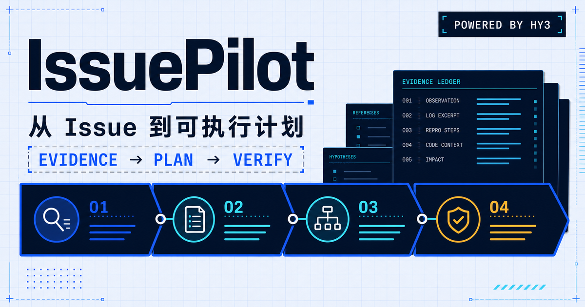
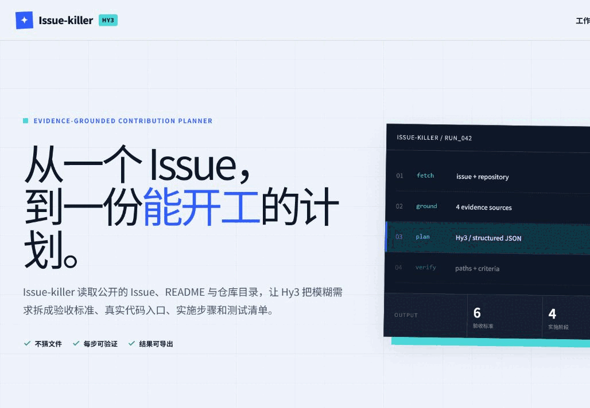
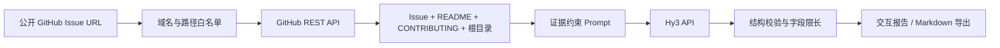

# Issue-killer

> 从一个 GitHub Issue，到一份有证据、能验证、可以直接开工的贡献计划。

Issue-killer 是为 [2026 腾讯犀牛鸟开源人才培养计划 · Hy3 Issue #4](https://github.com/Tencent-Hunyuan/Hy3/issues/4) 构建的端到端 Web 应用。它读取公开 GitHub Issue、仓库说明和真实目录，再由腾讯混元 **Hy3** 生成结构化的任务摘要、验收标准、代码入口、实施计划、风险、待确认问题与测试清单。



### 18 秒端到端演示



## Hy3 在系统中的角色

Hy3 是本项目唯一的生成式模型，负责把 GitHub 返回的非结构化证据转换为可执行的工程计划。它不负责抓取网页、访问任意 URL 或执行代码，也不会自行浏览仓库；这些上下文由应用先经过白名单校验，再通过 GitHub REST API 获取。

系统没有训练、微调或本地推理。所有模型能力均来自兼容 OpenAI Chat Completions 协议的 Hy3 API：

```text
POST https://tokenhub-intl.tencentcloudmaas.com/v1/chat/completions
model: hy3
```

## Issue #4 要求对照

| 任务要求 | Issue-killer 的实现 | 证据 |
| --- | --- | --- |
| CodeBuddy / WorkBuddy + Hy3 API | Hy3 已真实接入；CodeBuddy CLI 已完成三轮安全复核，修复全部 high/medium 问题，最终结论为 `pass` | [`docs/AI_COLLABORATION.md`](docs/AI_COLLABORATION.md)、[`docs/codebuddy-review.json`](docs/codebuddy-review.json) |
| 全程通过 API 调用 Hy3 | 服务端调用 Hy3 Chat Completions；无训练、微调和本地模型 | `lib/hy3.ts` |
| 至少一个交互前端 | 可输入 Issue URL 和个人 API Key 的响应式 Web 应用 | `app/IssueKillerApp.tsx` |
| 至少两个端到端 Demo | Hy3 #4（产品型）与 VulnGym #5（工程型） | `evals/results/`、`evals/report.md` |
| 不超过 2 分钟的视频或 GIF | 约 20 秒的双流程演示 GIF | `docs/demo/issue-killer-demo.gif` |
| 项目开源 | MIT License、完整运行文档与贡献指南 | `LICENSE`、`CONTRIBUTING.md` |
| README 说明 Hy3 角色 | 见上文与架构文档 | `docs/ARCHITECTURE.md` |
| 记录 AI 编程协作 | 按模块记录协作内容和人工验证 | `docs/AI_COLLABORATION.md` |

## 端到端工作流



关键约束：

- 只允许 `https://github.com/{owner}/{repo}/issues/{number}` 或 `/pull/{number}`，避免服务端请求伪造。
- 模型只能从 GitHub API 返回的根目录路径中推荐代码入口，证据不足时返回空数组。
- API Key 只在单次请求中使用，不写入浏览器存储、日志、数据库或评测结果。
- 上游错误被转换为可操作的中文提示，不向客户端返回密钥或原始请求。

## 本地运行

要求 Node.js `>=22.13.0`。

```bash
npm install
copy .env.example .env.local
npm run dev
```

打开 `http://localhost:3000`。有两种使用方式：

1. 在页面的 `Hy3 API Key` 输入框中填写自己的密钥；这是默认的 BYOK 模式。
2. 在本地环境中配置 `HY3_API_KEY`，页面将无需填写密钥。

环境变量：

| 名称 | 必需 | 说明 |
| --- | --- | --- |
| `HY3_API_KEY` | 否 | 服务端共享 Hy3 Key；不配置时使用 BYOK |
| `HY3_BASE_URL` | 否 | 默认 `https://tokenhub-intl.tencentcloudmaas.com/v1` |
| `HY3_MODEL` | 否 | 默认 `hy3` |
| `HY3_TIMEOUT_MS` | 否 | Hy3 请求超时，默认 `90000` 毫秒，可配置范围为 10–180 秒 |
| `GITHUB_TOKEN` | 否 | 提高 GitHub REST API 限额；只需要只读权限 |

## 两个 Demo

### Demo 01：产品型开放任务

- 输入：`https://github.com/Tencent-Hunyuan/Hy3/issues/4`
- 目标：从选题自由的活动任务中识别硬性验收标准、交付链和待确认事项。
- 重点检查：不能把“建议方向”误写为强制要求；应识别 API、前端、双流程、GIF、开源和文档要求。

### Demo 02：工程型数据修复任务

- 输入：`https://github.com/Tencent/VulnGym/issues/5`
- 目标：从具体的数据清理 Issue 中提取处理模式、边界情况、日志字段与测试策略。
- 重点检查：应覆盖整数/区间行号、跨文件调用链、保守/修复模式和 JSONL 约束。

真实运行产物保存在 `evals/results/`，汇总见 [`evals/report.md`](evals/report.md)。完整录制步骤见 [`docs/DEMO_GUIDE.md`](docs/DEMO_GUIDE.md)。

## 验证

```bash
npm run lint
npm test
```

用真实 Hy3 API 重跑两条评测：

```bash
set HY3_API_KEY=your-key
npm run eval
```

评测脚本默认请求 `http://localhost:3000/api/analyze`；可通过 `ISSUE_KILLER_BASE_URL` 指向其他部署。若 GitHub 匿名额度不足，可临时通过 `GITHUB_TOKEN` 提供只读令牌。脚本不会保存任何 Key 或 Token，只保存结构化结果和字段完整性检查。

## 技术栈

- Next.js / React / TypeScript
- vinext + Cloudflare Workers 兼容运行时
- GitHub REST API
- Tencent Hunyuan Hy3 Chat Completions API

## 项目结构

```text
app/
  api/analyze/route.ts     # 安全编排 GitHub 与 Hy3
  IssueKillerApp.tsx       # 交互界面与报告导出
lib/
  github.ts                # URL 白名单与 GitHub 证据读取
  hy3.ts                   # Prompt、Hy3 调用、输出校验
evals/
  cases.json               # 两个固定评测用例
  results/                 # 脱敏后的真实输出
docs/
  ARCHITECTURE.md          # 架构与信任边界
  AI_COLLABORATION.md      # AI 编程协作记录
  DEMO_GUIDE.md            # 双流程演示脚本
  SUBMISSION.md            # 向 rhinobird2026 提交的 PR 模板
```

## 限制

- 目前只读取公开仓库，并只获取 Issue、仓库元信息、README、CONTRIBUTING 和根目录；不会深度抓取整个代码库。
- 未配置 `GITHUB_TOKEN` 时受 GitHub 公共 API 访问频率限制。
- 输出是基于证据的贡献建议，不代表仓库维护者已经确认；最终开工前仍应阅读贡献指南并澄清报告中的问题。

## License

[MIT](LICENSE)
